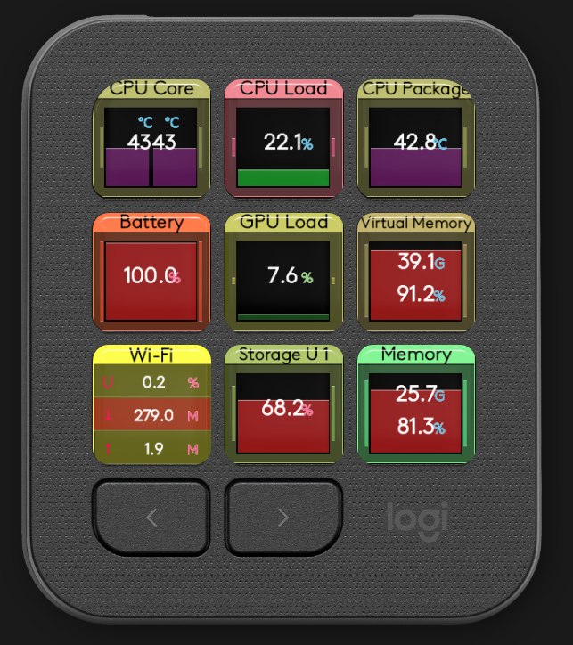

# Libre Hardware Monitor Plugin for Logitech Creative Keypad

LibreHardwareMonitorPlugin is a Logitech Actions SDK plugin that displays live PC hardware metrics from Libre Hardware Monitor on Logitech Creative Keypad devices.

The plugin surfaces key system telemetry such as CPU and GPU temperature, CPU and GPU load, memory usage, storage activity, and battery values.

This repository is a fork of mcmzero/librehardwaremonitorplugin and has been refactored toward Logitech Creative Keypad and modern .NET 8 build tooling.

    

### Notes

* Plugin works only on Windows 11/10 computers.
* Plugin targets Logitech Creative Keypad (MX Creative Console) through Logi Plugin Service.
* Plugin shows sensor values only when Libre Hardware Monitor is running.
* You need to start Libre Hardware Monitor manually once before plugin will be able to detect it.
* Libre Hardware Monitor is included and can be started from plugin actions or from the device.
* Libre Hardware Monitor needs to be run with elevated permissions, but plugin and Logi software do not.

### Requirements

* .NET 8 SDK
* Logi Options+ / Logi Plugin Service
* Libre Hardware Monitor running with the built-in web server enabled (default endpoint: `http://localhost:8085/data.json`)

### Build

Build from the plugin project:

    cd src/LibreHardwareMonitorPlugin
    dotnet build -c Release

The project targets net8.0-windows and writes build output to:

    bin/Release/win/

### Development Loop

Use watch build for fast iteration:

    cd src/LibreHardwareMonitorPlugin
    dotnet watch build

During build, the project writes a plugin link file to the Logi Plugin Service plugin folder and triggers a plugin reload.

### Package and Install

Install LogiPluginTool once:

    dotnet tool install --global LogiPluginTool

Pack and install the plugin:

    logiplugintool pack -input=bin/Release -output=LibreHardwareMonitor.lplug4
    logiplugintool install -path=LibreHardwareMonitor.lplug4

### Migration Status

This repository has moved to SDK-style .NET build flow (net8.0-windows) and Logitech Actions SDK tooling while preserving the existing plugin action model.
